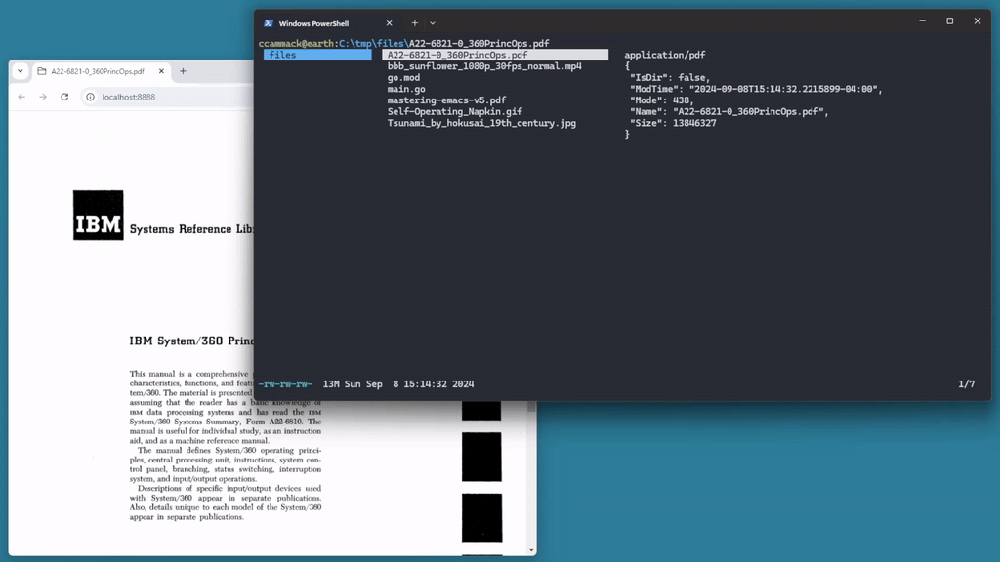

# Introduction

Cannon is an experimental browser-based file previewer for terminal file managers like [lf](https://github.com/gokcehan/lf).

It follows rules defined in its configuration to sample and convert each selected file into its web equivalent and then serves the converted file to the browser from an internal web server. It was originally written for Windows 8 but should run properly on any platform supported by Go.



# Installation

Installing Cannon's client (*cannon*) and server (*cannond*) requires a recent version of [Go](https://go.dev/):

```
go install -v github.com/ccammack/cannon/cmd/cannon@0776402b4154d8c31f924fe1c4107c3aa6df29fb
go install -v github.com/ccammack/cannon/cmd/cannond@0776402b4154d8c31f924fe1c4107c3aa6df29fb
```

After installation, copy the default [configuration file](https://github.com/ccammack/cannon/blob/main/.config/cannon/cannon.yml) to the appropriate [XDG_CONFIG_HOME](https://specifications.freedesktop.org/basedir-spec/latest/) location:

* On Windows, the configuration file should be copied to:
  * C:\Users\\**USERNAME**\\AppData\\Local\\cannon\\cannon.yml

* On Linux and other systems, the configuration file should be copied to:
  * ~/.config/cannon/cannon.yml

# Initial Configuration

## MIME Type Detection

Cannon relies on an external program to perform *MIME* type detection and the command to use is specified using the `*mime:` keys in the configuration. By default, this is accomplished on most platforms using the built-in `file` command. Specify the `'{input}'` placeholder in the right place so Cannon can insert the selected file:

```yaml
mime:           [ file, -b, --mime-type, '{input}' ]
```

On Windows, I use an environment variable to specify the full path to the version of `file` that ships with [`git` for Windows](https://gitforwindows.org/), which I installed using [scoop](https://scoop.sh/):

```yaml
os.windows.mime: [ '{env.USERPROFILE}/scoop/apps/git/current/usr/bin/file', -b, --mime-type, '{input}' ]
```

## Browser Selection

Running `cannond start` from the command line will automatically open a web browser to display the output. This defaults to [Chrome](https://www.google.com/chrome/) but can be configured using the `*browser:` keys in the configuration file. Browsers usually disable autoplay by default, so set the appropriate option to re-enable it in your browser for faster media previews. Specify the `'{url}'` placeholder in the right place in the command:

```yaml
browser:            [ google-chrome,                                             --autoplay-policy=no-user-gesture-required, '{url}' ]
os.windows.browser: [ '{env.ProgramFiles}/Google/Chrome/Application/chrome.exe', --autoplay-policy=no-user-gesture-required, '{url}' ]
```

# Running

Run `cannond start` in one console to start the server and open the browser. The server will check the configured dependencies and print warnings about any missing applications. Use the `--quiet` option when starting the server to suppress this output or configure the `*logfile:` to send it to a file.

```
$ cannond start
Starting server: http://localhost:8888
Error finding deps[0].apps[convert]: exec: "convert": executable file not found in $PATH
https://imagemagick.org ($ sudo apt install imagemagick)
```

Open a second console and run `cannon` with a native HTML media file, such as [Rube Goldberg's Self-Operating Napkin (1931)](Self-Operating_Napkin.gif "Image source: Wikimedia Commons"):

```
$ cannon Self-Operating_Napkin.gif
{"status":"success"}
image/gif
{
 "IsDir": false,
 "ModTime": "2024-07-15T19:30:28.690135633-04:00",
 "Mode": 420,
 "Name": "Self-Operating_Napkin.gif",
 "Size": 33065
}
```

The file will appear in the browser and the server console will output the steps it followed to display the file:

```
[...]

Select file: /home/ccammack/work/public/github.com/ccammack/cannon/Self-Operating_Napkin.gif
Match rule[0]: {0 true [apng avif gif jpg jpeg jfif pjpeg pjp png svg webp] false [] []  }
Apply rule[0]: {0 true [apng avif gif jpg jpeg jfif pjpeg pjp png svg webp] false [] []  }
Serve selected: 
```

Use `cannond stop` to stop the server:

```
$ cannond stop
{"status":"success"}
```
# File Manager Integration

## Configuring `lf`

Configuring [lf](https://github.com/gokcehan/lf) to use Cannon requires the `lfrc` file to set the previewer and also to map a key that toggles the server on and off. Integrating other file managers should follow a similar pattern.

On Windows, change the `lf` configuration file `C:\Users\USERNAME\AppData\Local\lf\lfrc` to `map` the `T` key to toggle the server and set the value for the `previewer`:

```ini
# configure previews
map T &cannond --quiet toggle
set previewer cannon
```

On Linux, change the `lf` configuration file `~/.config/lf/lfrc` in a similar fashion:

```ini
# configure previews
map T $(cannond --quiet toggle &)
set previewer cannon
```

Start `lf` as usual and then press `T` to start the server and open the preview browser. Browse the file system using `lf` and file previews should appear in the browser window. Press `T` again to stop the server.

## Closing Files

Cannon will stream native audio and video files directly to the browser when selected, but this locks the file and prevents `lf` from performing file operations on it. Use `cannon --quiet --close` to close a file and allow rename, delete and move operations to proceed. For example, this Powershell *move* script closes each selected file before attempting to move it in case the file is currently streaming:

```PS1
# create the output directory $args[0]
$dest = $args[0]
New-Item -ItemType Directory -Force -Path $dest | Out-Null

# move all of the files listed in $env:fx to the output directory
$files = [String[]]$env:fx
$files = $files.Split([System.Environment]::NewLine, [System.StringSplitOptions]::RemoveEmptyEntries) 
foreach ($file in $files) {
	# trim spaces and double quotes
	$file = $file.Trim().Trim('"').Trim()

	# tell cannon to close the file
	& cannon --quiet --close $file

	# move the file
	Move-Item -LiteralPath $file -Destination $dest -Force
}
```

# Additional Configuration

## Placeholder Patterns

The configuration file supports several kinds of `{placeholder}` strings which will be replaced with their current values at runtime:

* Most configuration values will accept the `'{env.*}'` placeholder to insert an environment variable

* `*mime:` values require the `'{input}'` placeholder

* `*browser:` values require the `'{url}'` placeholder

* `*cmd:` values require the `'{input}'` placeholder and usually the `'{output}'` placeholder with an optional extension: `'{output}.jpg'`

* `*src:` values require the `'{output}'` placeholder to define the output filename pattern that should be served on the page by the `src='{url}'` HTML attribute.

* `*html:` values generally use `'{url}'` to refer to the output file, but may also use `'{stdout}'` or `'{content}'` to directly capture the output from a successful file conversion

## Configuration Sharing

To support shared configurations between hosts with only minor differences between them, all keys in the file may be prefixed to define per-platform and per-host exceptions to the default values. Use **os**.<[$GOOS](https://go.dev/doc/install/source#environment)>.<**key**> to define a different value for each operating system and **host**.<**hostname**>.<**key**> to define a different value for each machine. Below, the *port* is set to 8888 on all platforms except Windows machines, which use 7777. The host named *hal9k* uses port 9999 no matter which OS it runs.

```yaml
port:            8888
os.windows.port: 7777
host.hal9k.port: 9999
```

At runtime, the most specific matching key that exists for each value will be used, so matching *host* keys will have the highest priority, followed by matching *os* keys, followed by the *default* key for each value.

> YAML configurations require consistent indentation on the left margin.

## Dependencies

The optional `*deps:` key can be used to make sure the expected file conversion programs are installed and warn the user if not. On `cannond start`, the program will check all of the executables specified in `*deps:*apps:` to make sure they exist and can be run. If not, Cannon will output the corresponding description specified in `*deps:*desc:` to give the user installation instructions for the missing program.

```ps1
Error finding deps[3].apps[chroma]: exec: "chroma": executable file not found in %PATH%
https://github.com/alecthomas/chroma/releases (download/extract into the $PATH)
```

## File Conversion Rules

Web browsers support a limited set of native HTML media files, so displaying other file types requires installing additional software and configuring Cannon to handle each file type. For example, [`ffmpeg`](https://ffmpeg.org/) can convert most audio and video files to a native format, [`ImageMagick`](https://imagemagick.org/) can convert most image formats, and [`MuPDF`](https://mupdf.com/) can convert the first page of a PDF to an image so it can be displayed in the browser.

To do this, install the desired conversion software, then configure the `*rules:` keys for each type to manage each conversion. The rules are processed in order from top to bottom, and each rule attempts to match the file against a list of file extensions (`*ext:`) and MIME types (`*mime:`).

When a match is found, Cannon will run the associated `*cmd:` to produce an output file and then serve the file using the specified `*html:`. If a rule does not specify a `*cmd:`, Cannon will attempt to serve the original file.

For example, `mp3` and `wav` files can be served directly using the `<audio>` tag without running a conversion. The `{url}` parameter is required for each `*html:` key:

```yaml
  - ################################################################
    # native audio extensions
    ext:  [ mp3, wav ]
    html: <audio autoplay loop controls src='{url}'>
```

All other audio files require sampling and conversion using `ffmpeg` to create a short audio preview. The `{input}` and `{output}` parameters are required for this conversion. The `{output}` parameter may specify an extension. The `*src:` key defines the output filename pattern that will be served on the page by the `src='{url}'` HTML attribute:

```yaml
  - ################################################################
    # non-native audio types
    mime: [ audio ]

    # use ffmpeg to sample the first few seconds of audio
    cmd:  [ ffmpeg, -ss, 0, -i, '{input}', -t, 3, '{output}.wav' ]
    src: '{output}.wav'

    html: <audio autoplay loop controls src='{url}'>
```

# Default File Display

If none of the conversion rules match or the specified conversion `*cmd:` fails, Cannon will display the first part of the file as raw data inside `<xmp>` tags. If a rule matches but a conversion `*cmd:` is not provided, Cannon will attempt to serve the original input file.
